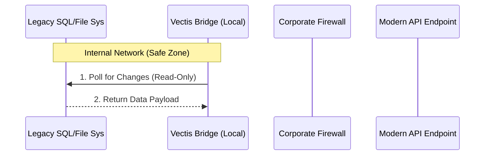

## 🛡️ Security & Compliance Architecture

This bridge is designed for **"Hostile Integration"** environments (legacy on-premise Windows Servers, air-gapped networks, and strict firewall rules).

It operates on a **"Zero-Trust / Outbound-Only"** model.

### 🔒 Operational Security
* **No Inbound Ports:** The script does *not* require opening port 80/443 on the corporate firewall. It is strictly an outbound agent.
* **Read-Only by Default:** The SQL queries and File System watchers are configured to run with `SELECT` / `READ` permissions only to prevent data corruption.
* **Ephemeral Memory:** No data is stored on the local disk. Payloads are constructed in RAM, encrypted, transmitted, and immediately discarded.

### 🏗️ Integration Logic (Sequence Diagram)

📋 Compliance
Audit Trail: All extraction events are logged locally to ./logs/audit.log for internal IT review.

Dependency-Free: Built using standard libraries to avoid "Supply Chain Attacks" via compromised npm/pip packages.

***

**Why this works:**
1.  **"No Inbound Ports":** This is the magic phrase that makes IT Directors relax.
2.  **"Read-Only":** This proves you won't brick their database (the "Phantom Inventory" fear).
3.  **The Diagram:** It looks like real engineering.

